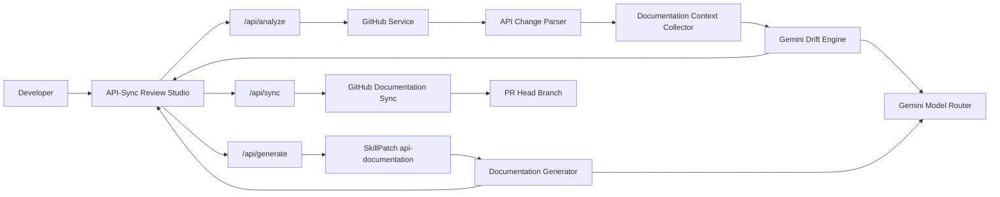

# API-Sync AI

> API documentation that stays in sync with your code.

API-Sync AI analyzes GitHub pull requests for API changes, identifies documentation drift, generates targeted documentation fixes using Gemini and SkillPatch, and lets developers review and commit updates directly back to their PR branch.

---

## The Problem

Codebases evolve much faster than documentation. When developers add endpoint parameters, modify route handlers, or update response schemas, manual documentation updates are often overlooked.

Over time, this creates **documentation drift** — where the repository's README or API specs contradict the actual code. Stale documentation causes broken frontend/mobile client integrations, wasted engineering hours, and developer frustration.

---

## How It Works

API-Sync AI operates as a progressive 3-stage review pipeline:

1. **Analyze:** Input a GitHub Pull Request URL. API-Sync AI deterministically parses modified route code, collects matching documentation sections, and prompts Gemini to perform semantic drift detection.
2. **Generate:** When drift is confirmed, API-Sync AI uses the installed SkillPatch `api-documentation` skill to format a precise Markdown documentation update.
3. **Sync:** Review the side-by-side proposal in the Review Studio and click **Approve & Sync** to commit the documentation update directly to the PR branch.

---

## Architecture



---

## Key Design Decisions

- **Deterministic Extraction over AI Guessing:** Route paths, HTTP methods (`GET`, `POST`, `PUT`, `DELETE`), path parameters (`:id`), query parameters (`req.query`), and status codes (`200`, `404`) are parsed using strict regular expressions without LLMs.
- **Deterministic Target File Resolution:** Existing documentation files (`docs/api.md`, `README.md`) are matched using heading and route context, ensuring generated updates target the correct file rather than inventing arbitrary filenames.
- **Evidence-Grounded Drift Detection:** Gemini evaluates semantic mismatches using strict zero-hallucination rules, citing concrete code and documentation evidence.
- **Authoritative SkillPatch Integration:** Documentation formatting rules are loaded dynamically from the repository's installed `.latentcode/skills/api-documentation/SKILL.md`.
- **Automatic Model Fallback Router:** Gemini requests route through a priority sequence (`gemini-3.7-flash` → `gemini-3.6-flash` → `gemini-3.5-flash-lite`), automatically handling rate limits (429) or model unavailability.
- **SHA Concurrency & Branch Safety:** Sync commits target the PR's HEAD branch specifically and verify file SHAs to prevent overwriting concurrent changes on GitHub.

---

## Features

- **GitHub PR Ingestion:** Retrieves PR metadata, changed files, and patch diffs via Octokit.
- **Multi-Framework Route Parsing:** Supports Express, Koa, FastAPI, NestJS, and Next.js App Router handlers.
- **Markdown Context Collection:** Parses headings (`#`, `##`, `###`) and extracts relevant documentation sections.
- **Semantic Drift Diagnosis:** Categorizes findings as `CONFIRMED_DRIFT`, `NO_DRIFT`, or `UNCERTAIN` with severity levels.
- **Progressive Review Studio:** Side-by-side comparison studio displaying current docs vs SkillPatch proposal.
- **One-Click GitHub Sync:** Commits approved documentation updates directly to the GitHub PR branch.

---

## Tech Stack

- **Framework:** Next.js 15 (App Router, TypeScript)
- **Styling:** Tailwind CSS
- **GitHub Integration:** `@octokit/rest`
- **Runtime AI Provider:** `@google/genai` (Gemini API)
- **Skill Engine:** [SkillPatch `api-documentation`](.latentcode/skills/api-documentation/SKILL.md)
- **Testing:** Vitest (71 unit tests)

---

## Getting Started

### Prerequisites

Node.js 18+ and npm installed.

### Installation

1. Clone the repository and install dependencies:
   ```bash
   git clone https://github.com/toufiqfarhan0/api-sync.git
   cd api-sync
   npm install
   ```

2. Configure environment variables:
   ```bash
   cp .env.example .env.local
   ```

3. Add your Gemini API key in `.env.local`:
   ```env
   GEMINI_API_KEY=your_gemini_api_key_here
   GITHUB_TOKEN=optional_github_pat
   ```

4. Start the development server:
   ```bash
   npm run dev
   ```

5. Open [http://localhost:3000](http://localhost:3000) in your browser.

---

## Environment Variables

| Variable | Required | Description |
| :--- | :---: | :--- |
| `GEMINI_API_KEY` | **Yes** | Server-side key for Gemini drift detection & SkillPatch generation. |
| `GITHUB_TOKEN` | Optional | GitHub Personal Access Token for higher rate limits and private repo write access. |

See [.env.example](.env.example) for template configuration.

---

## Example Workflow

1. Paste a GitHub PR URL (e.g. `https://github.com/owner/repo/pull/12`) into API-Sync AI.
2. Click **Analyze Drift**. API-Sync AI extracts route changes, matches docs, and diagnoses drift in ~2 seconds.
3. Review the flagged route modifications and Gemini's evidence-based explanation.
4. Click **Generate Documentation Update** to trigger SkillPatch structured doc generation.
5. Inspect the current documentation snippet vs proposed Markdown update side-by-side.
6. Click **Approve & Sync to GitHub**. API-Sync AI commits the approved fix directly to the PR branch.

---

## Safety & Reliability

- **No Unsolicited Writes:** GitHub commits occur ONLY after explicit developer approval.
- **Branch Protection:** Sync commits target the PR's HEAD branch (`head.ref`), preserving `main`.
- **Path Traversal Guard:** Input file paths are sanitized to prevent writing outside repository boundaries.
- **Server-Side Secret Isolation:** `GEMINI_API_KEY` and `GITHUB_TOKEN` are executed strictly server-side and never exposed to the client.

---

## Project Structure

```text
api-sync/
├── .latentcode/skills/api-documentation/  # Installed SkillPatch skill
├── src/
│   ├── app/                               # Next.js App Router & API routes
│   │   ├── api/analyze/                   # Stage 1: Ingestion & Drift Analysis
│   │   ├── api/generate/                  # Stage 2: SkillPatch Doc Generation
│   │   └── api/sync/                      # Stage 3: GitHub PR Commit Sync
│   └── lib/
│       ├── api-parser/                    # Deterministic route & patch parser
│       ├── doc-collector/                 # Markdown section extraction
│       ├── doc-generator/                 # SkillPatch loader & doc engine
│       ├── drift-engine/                  # Gemini semantic drift analyzer
│       ├── gemini/                        # Shared Gemini Model Router & Fallback
│       └── github/                        # Octokit PR retrieval & commit service
├── .env.example
├── README.md
└── context.md
```

---

## BuildSprint 2026

Built for **BuildSprint 2026** by team **LatentForce.ai** using **LatentCode** as the AI coding harness and **SkillPatch** for standardized documentation generation.

---

## Navigation & Repository Links

- **GitHub Repository:** [https://github.com/toufiqfarhan0/api-sync](https://github.com/toufiqfarhan0/api-sync)
- **Installed SkillPatch Skill:** [.latentcode/skills/api-documentation/SKILL.md](.latentcode/skills/api-documentation/SKILL.md)
- **Environment Template:** [.env.example](.env.example)
- **Source Code:** [src/](src/)
- **Internal Context:** [context.md](context.md)
